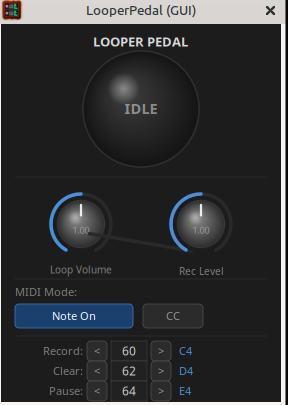

# LooperPedal

An LV2 guitar looper pedal plugin with MIDI control.

**Author:** rbmannchued — [github.com/rbmannchued](https://github.com/rbmannchued)



---

## Features

- Record, overdub, play and pause audio loops up to 120 seconds
- Seamless loop crossfade (256 samples) to eliminate boundary clicks
- Hard-clip overdub limiter to prevent amplitude buildup
- Configurable MIDI trigger: Note On or CC mode
- Independent Loop Volume and Rec Level controls (0–2×)
- State output port for host visualization
- Lightweight X11/Cairo UI — works in Carla, Ardour, Reaper and any host with `ui:X11UI` support

---

## States

| State | Description |
|-------|-------------|
| **IDLE** | No loop recorded. Audio passes through. |
| **RECORDING** | Capturing input to the loop buffer. |
| **PLAYING** | Looping the recorded audio. Input is mixed in. |
| **OVERDUBBING** | Layering new input onto the existing loop. |
| **PAUSED** | Playback frozen. Audio passes through. |

State transitions:

```
IDLE ──[rec]──► RECORDING ──[rec]──► PLAYING ──[rec]──► OVERDUBBING
                                         │                    │
                                      [pause]             [pause]
                                         ▼                    ▼
                                       PAUSED ◄──────────────┘
any state ──[clr]──► IDLE
```

---

## Controls

### Knobs

| Control | Range | Default | Description |
|---------|-------|---------|-------------|
| Loop Volume | 0.0 – 2.0 | 1.0 | Playback gain of the recorded loop |
| Rec Level | 0.0 – 2.0 | 1.0 | Input gain while recording and overdubbing |

Drag up/down or scroll to adjust. Hold **Shift** while scrolling for fine control.

### MIDI Mode

| Mode | Trigger |
|------|---------|
| **Note On** | Note-on message with velocity > 0 |
| **CC** | Control Change message |

### MIDI Trigger Notes / CCs

| Action | Default |
|--------|---------|
| Record / Stop / Overdub | 60 (C4) |
| Clear | 62 (D4) |
| Pause / Resume | 64 (E4) |

Click `<` / `>` or scroll over each row to change the note number.

---

## Building

**Dependencies:**

- LV2 SDK (`lv2-dev`)
- Cairo with Xlib backend (`libcairo2-dev`)
- X11 (`libx11-dev`)

```bash
make
```

**Install system-wide** (requires sudo):

```bash
sudo make install
```

**Install for current user** (no sudo):

```bash
make install-user
```

The bundle is installed to `~/.lv2/looper.lv2/`.

---

## Plugin Info

| Field | Value |
|-------|-------|
| URI | `urn:rafa:Looper` |
| UI URI | `urn:rafa:Looper#ui` |
| UI type | `ui:X11UI` |
| Category | `lv2:UtilityPlugin` |
| Max loop length | 120 seconds |
